<!-- Visuals are generated by scripts/build_assets.py — edit the script, not the SVGs. -->

<picture>
  <source media="(prefers-color-scheme: dark)" srcset="assets/hero-dark.svg">
  
</picture>

  

<a href="https://www.linkedin.com/in/rohit-kumar-857b38360/"><picture><source media="(prefers-color-scheme: dark)" srcset="assets/pill-linkedin-dark.svg"></picture></a>&nbsp;<a href="https://huggingface.co/Mohitrks"><picture><source media="(prefers-color-scheme: dark)" srcset="assets/pill-huggingface-dark.svg"></picture></a>&nbsp;<a href="https://mohitrks-aria.hf.space"><picture><source media="(prefers-color-scheme: dark)" srcset="assets/pill-aria-live-dark.svg"></picture></a>&nbsp;<a href="https://birdid-umber.vercel.app"><picture><source media="(prefers-color-scheme: dark)" srcset="assets/pill-birdid-live-dark.svg"></picture></a>

 

<picture>
  <source media="(prefers-color-scheme: dark)" srcset="assets/section-work-dark.svg">
  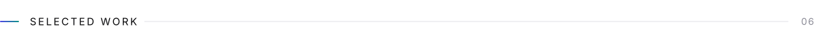
</picture>

<a href="https://github.com/Rohit-0612/aria"><picture><source media="(prefers-color-scheme: dark)" srcset="assets/card-aria-dark.svg"></picture></a>
<a href="https://github.com/Rohit-0612/birdid"><picture><source media="(prefers-color-scheme: dark)" srcset="assets/card-birdid-dark.svg"></picture></a>

<a href="https://github.com/Rohit-0612/HHGoa26-Voice-Rag"><picture><source media="(prefers-color-scheme: dark)" srcset="assets/card-voice-rag-dark.svg"></picture></a>
<a href="https://github.com/Rohit-0612/CI-Failure-Triage-Agent"><picture><source media="(prefers-color-scheme: dark)" srcset="assets/card-ci-triage-dark.svg"></picture></a>

<a href="https://github.com/Rohit-0612/finstock-research-assistant"><picture><source media="(prefers-color-scheme: dark)" srcset="assets/card-finstock-dark.svg">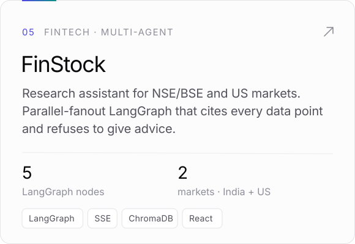</picture></a>
<a href="https://github.com/Rohit-0612/multi-agent-codegen"><picture><source media="(prefers-color-scheme: dark)" srcset="assets/card-codegen-dark.svg">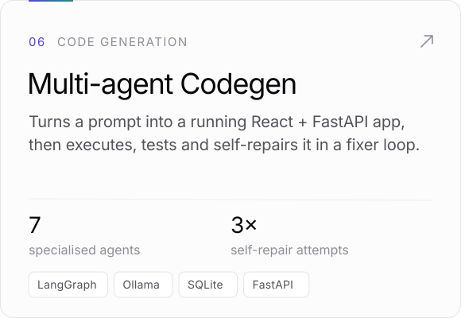</picture></a>

 

<picture>
  <source media="(prefers-color-scheme: dark)" srcset="assets/section-also-dark.svg">
  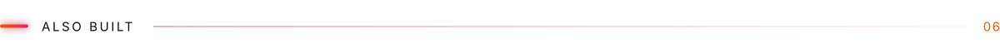
</picture>

| Project | What it does | Stack |
|:--|:--|:--|
| **[FormPilot](https://github.com/Rohit-0612/formpilot)** | Fills PDF forms: a form IR, rule-first + LLM field understanding, deterministic validation, human review | `Python` `LLM` |
| **[Sales Forecasting](https://github.com/Rohit-0612/state-sales-forecasting)** | ARIMA, Prophet, XGBoost and LSTM per state for 43 US states, best model picked on a strict out-of-sample window | `Time series` `FastAPI` |
| **[Olist Analysis](https://github.com/Rohit-0612/olist-ecommerce-analysis)** | 100k e-commerce orders: PostgreSQL modelling, six analytical queries, Streamlit dashboard | `SQL` `Streamlit` |
| **[MedBot RAG](https://github.com/Rohit-0612/medbot-rag)** | Medical Q&A over pharmacology case reports with Qdrant hybrid retrieval and reranking | `Flask` `Qdrant` |
| **[Hacker House 2026](https://github.com/Rohit-0612/Hacker-House-2026)** · [live](https://hacker-house-2026-kappa.vercel.app) | Event site with a browser-only pass generator that renders 3200×1800 PNGs client-side | `Next.js` `Canvas` |
| **[Customer Segmentation](https://github.com/Rohit-0612/Customer-Segmentation-Financial-Analysis)** | K-Means over credit-card behaviour into low, moderate and high financial-risk groups | `scikit-learn` `EDA` |

 

<picture>
  <source media="(prefers-color-scheme: dark)" srcset="assets/section-stack-dark.svg">
  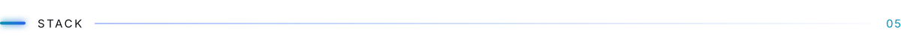
</picture>

<picture>
  <source media="(prefers-color-scheme: dark)" srcset="assets/stack-dark.svg">
  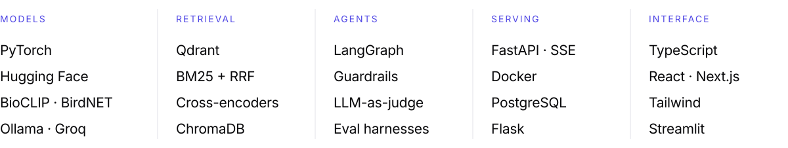
</picture>

  

<picture>
  <source media="(prefers-color-scheme: dark)" srcset="assets/section-principles-dark.svg">
  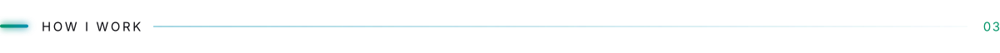
</picture>

<picture>
  <source media="(prefers-color-scheme: dark)" srcset="assets/principles-dark.svg">
  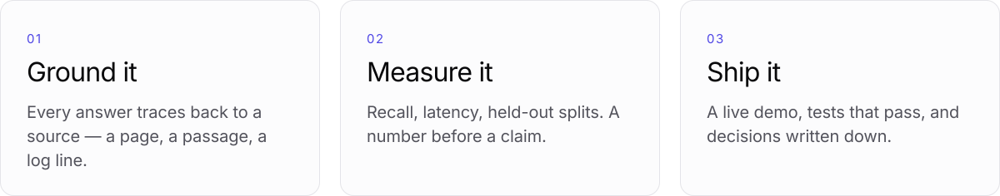
</picture>

  

<picture>
  <source media="(prefers-color-scheme: dark)" srcset="assets/section-activity-dark.svg">
  
</picture>

<picture>
  <source media="(prefers-color-scheme: dark)" srcset="https://raw.githubusercontent.com/Rohit-0612/Rohit-0612/output/github-snake-dark.svg">
  
</picture>

<picture>
  <source media="(prefers-color-scheme: dark)" srcset="assets/footer-dark.svg">
  
</picture>
